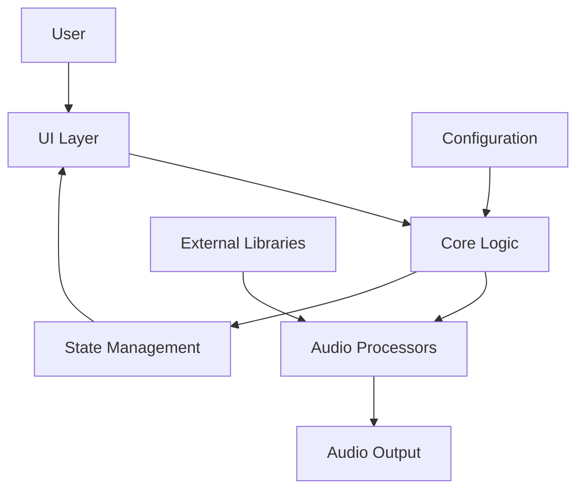

# System Architecture

## Executive Summary

**Flitzis Looper** is a monolithic Python desktop application for audio processing and looping. The system is designed with a component-based architecture that separates audio processing, core application logic, user interface, and utility functions.

## Technology Stack

| Category | Technology | Version |
|----------|------------|---------|
| **Core Language** | Python | >=3.13.9 |
| **Audio Processing** | demucs, madmom, pedalboard, pyo | Latest |
| **Machine Learning** | torch, torchaudio | >=2.9.1 |
| **Numerical Computing** | numpy | >=2.3.5 |
| **Visualization** | matplotlib | >=3.10.7 |
| **Build System** | none | |
| **Code Quality** | mypy, ruff | Latest |

## Architecture Pattern

**Component-Based Desktop Application** with the following characteristics:

- **Modular Design:** Clear separation of concerns between audio processing, core logic, and UI
- **Event-Driven:** UI events trigger core application operations
- **Real-time Processing:** Audio operations performed with low latency
- **State Management:** Centralized application state with reactive updates

## Data Architecture

### Audio Data Flow
```
User Interaction → UI Components → Core Logic → Audio Processors → Audio Output
```

### State Management
- Centralized in `core/state.py`
- Reactive updates to UI components
- Persistent configuration storage

## API Design

### Internal APIs
- **Core → Audio:** Function calls with audio buffers
- **UI → Core:** Event-based communication
- **Core → UI:** State updates and notifications

### External Dependencies
- **Audio Libraries:** demucs, madmom, pedalboard, pyo
- **ML Framework:** PyTorch for audio processing
- **System:** liblo for OSC support

## Component Overview

### Audio Processing Components
- **BPM Detection:** Tempo analysis and synchronization
- **Loop Management:** Audio loop recording and playback
- **Pitch Processing:** Pitch detection and manipulation
- **Stem Separation:** Source separation (vocals, drums, bass, etc.)
- **Audio Server:** Real-time audio streaming and processing

### Core Application Components
- **Application Core:** Main application lifecycle and coordination
- **Bank Management:** Sample and loop organization
- **BPM Control:** Tempo synchronization logic
- **Configuration:** Settings and preferences management
- **State Management:** Centralized application state
- **Volume Control:** Audio volume management

### UI Components
- **Main Window:** Primary application interface
- **Loop Grid:** Visual representation of audio loops
- **Stems Panel:** Stem separation controls
- **Dialogs:** Configuration dialogs (BPM, Volume, Waveform)
- **Widgets:** Custom UI elements (EQ Knobs, VU Meters)
- **Toolbar:** Quick access to common functions

## Source Tree

See [Source Tree Analysis](./source-tree-analysis.md) for detailed directory structure.

## Development Workflow

### Build Process
1. **Dependency Installation:** `uv pip install -e . --dev`
2. **Type Checking:** `mypy flitzis_looper`
3. **Code Formatting:** `ruff format flitzis_looper`
4. **Linting:** `ruff check flitzis_looper`
5. **Packaging:** `python -m build`

### Deployment Process
1. **Build Distribution:** `python -m build --wheel`
2. **Installation:** `pip install dist/flitzis_looper-*.whl`
3. **System Dependencies:** Ensure `liblo` is installed

## Testing Strategy

### Quality Assurance
- **Static Analysis:** mypy for type checking
- **Code Style:** ruff for formatting and linting
- **Manual Testing:** Functional testing of audio features
- **Integration Testing:** UI and core logic interaction

### Recommended Test Coverage
- Audio processing edge cases
- UI component interactions
- State management scenarios
- Error handling and recovery

## Performance Considerations

### Optimization Areas
- **Audio Processing:** Buffer size optimization
- **Real-time Operations:** Low-latency audio pipelines
- **Memory Management:** Efficient audio buffer handling
- **UI Responsiveness:** Non-blocking operations

### Scalability
- **Modular Design:** Easy to add new audio effects
- **Component Reuse:** Shared utilities and widgets
- **Extensible Architecture:** Plugin system potential

## Security Considerations

### Data Protection
- No sensitive user data collected
- Local file operations only
- No network communication in core functionality

### Dependency Security
- Regular dependency updates
- Vulnerability scanning recommended
- Secure coding practices

## Architecture Diagram



## Future Evolution

### Potential Enhancements
- **Plugin System:** Extensible audio effects
- **Network Sync:** Multi-device synchronization
- **Cloud Integration:** Sample library access
- **Advanced AI:** Machine learning-enhanced audio processing

### Migration Paths
- Gradual refactoring to maintain compatibility
- Feature flags for experimental functionality
- Comprehensive testing for backward compatibility

## Conclusion

Flitzis Looper represents a well-structured monolithic desktop application with clear separation of concerns. The component-based architecture facilitates maintainability and extensibility while providing real-time audio processing capabilities.
